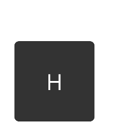
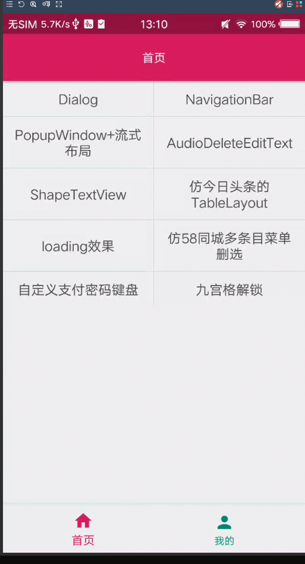
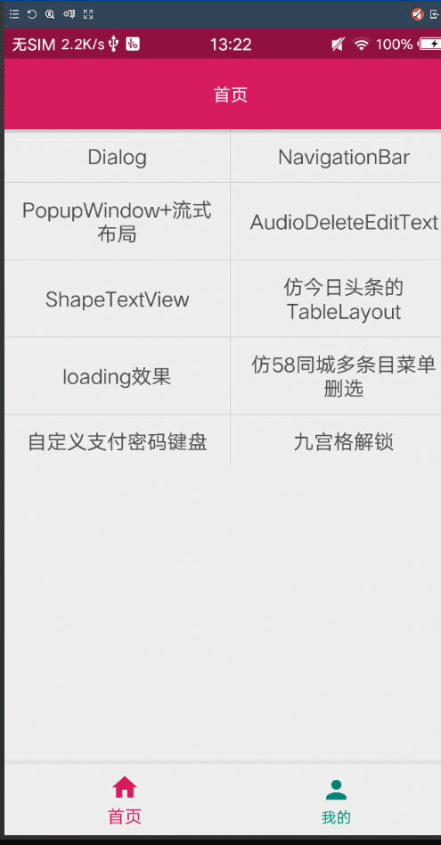

# BasicUI

- 目前[BasicUI](https://github.com/Peakmain/BasicUI)包括了：1、Recycleview的封装，支持单布局和多布局，支持添加头部和底部，还包括了悬浮列表的基本封装。2、dialog的封装。支持从底部弹出，并可设置动画，是否宽度全屏等样式。3、NavigationBar的封装，可以在activity中动态设置添加头部。4、PopupWindow的封装 5、editText的封装，自带清除按钮，并设置按钮的颜色和按钮的资源 6、TextView的封装、支持设置背景颜色和背景的圆角大小，以及支持设置文字上下左右的图标居中 7、流式布局的封装（支持刷新数据）、8、仿今日头条的TableLayout、9、花束加载loading效果、10、仿58同城多条目菜单删选封装
### How to
#### Step 1. Add the JitPack repository to your build file
Add it in your root build.gradle at the end of repositories:
```
	allprojects {
		repositories {
			...
			maven { url 'https://jitpack.io' }
		}
	}
```

#### Step 2. Add the dependency
```
	dependencies {
	        implementation 'com.github.Peakmain:BasicUI:0.0.3'
	}
```
#### 关于Recyclerview的使用
- 单布局继承于 CommonRecyclerAdapter<T>,其中需要的方法是
```
public CommonRecyclerAdapter(Context context, List<T> data, int layoutId) {}
```
1、关于设置文本，第一种我们可以直接holder.setText方法
```
holder.setText(int viewId,CharSequence text)
```
第二种就是首先getView然后设置文字
```
TextView tv=holder.getView(view viewId)
tv.setText("")
```
2、除了设置文本之外，里面还提供了设置文字的颜色，文字的大小，view的点击事件和长按事件，view是否可见，某一条的点击事件

3、关于设置图片，我提供了一个默认Glide加载图片
```
  holder.setImageByUrl(R.id.iv_meizhi, new GlideImageLoader(item.getUrl()));
```
如果大家不想使用Glide或者想用自己的Glide，大家可以新建一个类去继承ViewHolder.HolderImageLoade即可

for example:
```
public class PagePoupAdapter extends CommonRecyclerAdapter<String>{
    private int mSelectPosition=0;
    public PagePoupAdapter(Context context, List<String> data) {
        super(context, data, R.layout.item_popup_window);
    }

    @Override
    public void convert(ViewHolder holder, String item) {
        TextView tvName=holder.getView(R.id.tv_name);
        tvName.setText(item);
       tvName.setTextColor(mContext.getResources().getColor(R.color.colorAccent));
    }
}
```
- 关于多布局
也是继承extends CommonRecyclerAdapter<T>.但是实现的方法是  
```
 public CommonRecyclerAdapter(Context context, List<T> data, MultiTypeSupport<T> multiTypeSupport) {}
```
for example:
```
    public SearchCityAdapter(Context context, List<SearchCityBean> data) {
        super(context, data, new MultiTypeSupport<SearchCityBean>() {
            @Override
            public int getLayoutId(SearchCityBean item, int position) {
                return R.layout.default_city_recycler_item;
            }
        });
    }
    @Override
    public void convert(ViewHolder holder, SearchCityBean item) {
        int itemViewType = getItemViewType(holder.getAdapterPosition());
        if (itemViewType == R.layout.default_city_recycler_item) {
            holder.setText(R.id.tv_city_name, item.getName());
        }
    }
```

- 我们有时候会使用到recycleview的悬浮列表，这里我也提供了一个基本的悬浮列表BaseSuspenisonItemDecoration，使用很简单，大家只需要继承BaseSuspenisonItemDecoration即可
因为有时候我们需要自定背景颜色和文字颜色，文字的大小，悬浮之间的距离等。这里我提供了Builder方法，大家继承即可

for example:
```
public class SectionItemDecoration extends BaseItemDecoration<SearchCityBean> {

    public SectionItemDecoration(Builder builder) {
        super(builder);
    }
    @Override
    public String getTopText(List<SearchCityBean> data, int position) {
        return data.get(position).getSection();
    }
    public static class Builder extends BaseItemDecoration.Builder<SectionItemDecoration.Builder,SearchCityBean>{

        public Builder(Context context, List<SearchCityBean> data) {
            super(context, data);
        }
        @Override
        public SectionItemDecoration create() {
            return new SectionItemDecoration(this);
        }
    }
}
```
使用非常简单
```
   SectionItemDecoration decoration = new SectionItemDecoration.Builder(this, mAllCities)
                .setBgColor(ContextCompat.getColor(this,R.color.colorAccent))
                .setTextColor(ContextCompat.getColor(this,R.color.color_black))
                .setSectionHeight(SizeUtils.dp2px(this,30))
                .create();
```

#### 关于NavigationBar的使用
我们每次在项目添加头部的时候，一般做法都是说定义一个公用的布局，但是这其实并不友好，而且都需要findVIewById,我这里用了Builder设计模式，可以动态添加头部
```
    mDefaultNavigationBar = new DefaultNavigationBar
                  .Builder(this, (ViewGroup) findViewById(android.R.id.content))
                  //Whether to display the return button
                  .setDisplayHomeAsUpEnabled(true)
                  //Set left click event
                  .setLeftClickListener(v -> {
  
                  })
                  //Whether to display the title that comes with the toolbar by default
                  .setDisplayShowTitleEnabled(true)
                  //Hide right view
                  .hideRightView()
                  //Set the click event of the return button
                  .setNavigationOnClickListener(v -> finish())
                  //set left text color
                  .setLeftTextColor(ContextCompat.getColor(this,R.color.color_272A3D))
                  //set title
                  .setTitleText("")
                  //set toolbar background color
                  .setToolbarBackgroundColor(0)
                  .create();
```


####关于AlertDialog
支持从底部弹出，支持宽度全屏，支持设置动画
```
        AlertDialog dialog = new AlertDialog.Builder(ImagePreviewActivity.this)
                .setContentView(R.layout.dialog_show_image_deal)
                .fromButtom(true)
                // Set click events for view
                .setOnClickListener(R.id.bt_logout, new View.OnClickListener() {
                    @Override
                    public void onClick(View v) {
                    }
                })
                //set animation
                .setAnimation(R.style.dialog_from_bottom_anim)
                //Eject from bottom
                .fromButtom(true)
                //set width  MATCH_PARENT
                .setFullWidth()
                .show();
```


#### 关于PopupWindow的封装
```
       new CustomPopupWindow.PopupWindowBuilder(this)
                .setView(R.layout.popup_window_view)
                .enableBackgroundDark(true)
                .setAnimationStyle(R.style.PopupWindowAnimation)
                .setBgDarkAlpha(0.7f)
                .create();
```


#### TextView的封装
这个支持设置背景颜色，背景的圆角，线条的颜色，线条的宽度，支持文字上下左右图片资源两者居中，减少布局嵌套,使用方法还是android:drawableLeft=""
```
    <com.peakmain.ui.widget.ShapeTextView
        android:id="@+id/shape_text_view"
        android:layout_width="@dimen/space_100"
        android:layout_height="@dimen/space_100"
        android:layout_centerInParent="true"
        android:gravity="center"
        android:textColor="@color/color_white"
        android:textSize="28sp"
        tools:text="A"
        app:shapeTvRadius="@dimen/space_6"
        app:shapeTvBackgroundColor="#333333" />
```
>说明：一共有四个属性:shapeTvStrokeWidth线的宽度、shapeTvStrokeColor线的颜色、shapeTvRadius圆角的半径、shapeTvBackgroundColor背景颜色



#### EditText的封装
自带清除按钮的图标，并且可对删除按钮进行填色，或者对删除按钮图标进行替换
```
    <com.peakmain.ui.widget.AutoDeleteEditText
                    android:id="@+id/edt_address"
                    android:layout_width="0dp"
                    android:layout_height="match_parent"
                    android:layout_weight="3"
                    android:paddingBottom="@dimen/spacing_5"
                    app:ad_HintColor="@color/color_9B9B9B"
                    app:ad_TextColor="@color/color_4A4A4A"
                    app:ad_TextSize="@dimen/font_16"
                    app:ad_hint="@string/input_details_address"
                    app:ad_paddingTop="@dimen/spacing_15"
                    app:ad_top="true" />
```
>说明：一共有11个属性:字体大小adet_text_size、字体颜色adet_text_color、未输入文字时字体颜色adet_hint_color、内容是否居上adet_isTop、内容内边距离顶部的距离adet_padding_top、hint的资源adet_hint、是否单行adet_isSingle、输入类型android:inputType、输入长度adet_max_length、删除的图片的颜色adet_tint_color、删除图片的资源adet_delete_src

#### 关于流式布局的使用
大家直接在布局中引用即可
```
<com.peakmain.ui.widget.FlowLayout
    android:layout_width="match_parent"
    android:layout_height="wrap_content"/>
```
在activity中直接设置adapter即可
```
BaseFlowAdapter adapter=new BaseFlowAdapter() {
                @Override
                public int getCount() {
                    return mCount;//自己数据的实体类的大小
                }

                @Override
                public View getView(final int position, ViewGroup parent) {
                    return view;//自己的view
                }
            }
    mFlowLayout.setAdapter(adapter);
```
如果想刷新数据只需要调用自己封装的adapter的notifyDataChange方法即可
```
adapter.notifyDataChange();
```
#### 仿今日头条的TableLayout的使用
- 效果


- 使用：
第一步：自定义自己的TableLayout继承BaseTabLayout<T>将泛型换成自己的实体类就可以了
```
public class TabLayout extends BaseTabLayout<ProjectTreeBean> {//换成自己的实体类


    public TabLayout(Context context) {
        super(context);
    }

    public TabLayout(Context context, AttributeSet attrs) {
        super(context, attrs);
    }

    public TabLayout(Context context, AttributeSet attrs, int defStyleAttr) {
        super(context, attrs, defStyleAttr);
    }

    @Override
    public String setTableTitle(List<ProjectTreeBean> bean, int position) {
        return bean.get(position).getName();//标题的名字，换成自己的
    }
}
```
第二步：在自己的布局中使用自己定义的布局就可以了
>说明：一共有三个属性大家可以设置。1、未选中文字的颜色originColor，2、选中时候的文字颜色changeColor，3、是否显示下划线isShowUnderLine（下划线的颜色和选中的时候的文字颜色一致）


#### 花束加载loading效果
两种方式：1、大家在布局中使用
```
<com.peakmain.ui.loading.CircleLoadingView
    android:layout_width="wrap_content"
    android:layout_height="wrap_content"/>
```
2、直接在activity中使用show的方式显示和hide的方法隐藏
```
        CircleLoadingView loadingView=new CircleLoadingView(this);
        loadingView.show();
        loadingView.hide();
```
未设置自定义属性，后期会加入
#### 仿58同城多条目菜单删选封装
- 效果


- 使用
1、第一步：继承BaseListMenuAdapater,需要设置三个参数,第一个设置标题的布局，第二个设置菜单view的布局，第三个设置菜单的内容
```
public class ListMenuAdapter extends BaseListMenuAdapater {
  @Override
    public int getTitleLayoutId() {
        return R.layout.ui_list_data_screen_tab;//自己标题的布局
    }

    @Override
    protected void setMenuContent(View menuView, final int position) {
           //不同菜单的布局参数设置
    }

    @Override
    protected int getMenuLayoutId() {
        return R.layout.ui_list_data_screen_menu;//自己菜单的布局
    }
}
```
第二步：布局中引入ListMenuView
```
   <com.peakmain.ui.widget.menu.ListMenuView
        android:id="@+id/list_data_screen_view"
        android:layout_width="match_parent"
        android:layout_height="match_parent"/>
```
第三步：设置adapter即可,需要将标题集合传进去
```
        mMenuView = findViewById(R.id.list_data_screen_view);
        mMenuView.setAdapter(adapter);//自己的适配器
```
loading效果


#### 视察动画的loading,布局中直接使用
```
    <com.peakmain.ui.loading.InspectLoadingView
        android:id="@+id/inspect_loading_view"
        android:layout_width="match_parent"
        android:layout_height="match_parent" />
```
activity中需要调用show方法来显示
```
  mInspectLoadingView.show();
```
隐藏只需要调用hide方法
```
mInspectLoadingView.hide();
```

#### 仿钉钉的loading
```
    <com.peakmain.ui.loading.RotatingLoadingView
        android:id="@+id/rotating_loading_view"
        android:onClick="click"
        android:layout_width="match_parent"
        android:layout_height="match_parent"/>
```
默认设置的是全屏展示，如果想以loading的方式显示，可以调用show方法
```
        RotatingLoadingView rotatingLoadingView = new RotatingLoadingView(this);
        rotatingLoadingView.show();
```
隐藏还是hide方法
```
mLoadingView.hide();
```

#### 仿58同城加载loading
 ```
 <com.peakmain.ui.loading.ShapeLoadingView
        android:id="@+id/shape_loading_view"
        android:onClick="click"
        android:layout_width="match_parent"
        android:layout_height="match_parent"/>
```
默认也是全屏，如果想以loading显示，可以使用show方法
```
    ShapeLoadingView shapeLoadingView = new ShapeLoadingView(this);
    shapeLoadingView.show();
```
#### 自定义支付密码键盘
  ```
<?xml version="1.0" encoding="utf-8"?>
<RelativeLayout xmlns:android="http://schemas.android.com/apk/res/android"
    android:layout_width="match_parent"
    android:layout_height="match_parent"
    android:id="@+id/view_root"
    xmlns:app="http://schemas.android.com/apk/res-auto"
    android:orientation="vertical">

    <com.peakmain.ui.widget.password.PasswordEditText
        android:id="@+id/password_edit_text"
        android:layout_width="match_parent"
        android:layout_marginTop="@dimen/space_20"
        android:layout_marginLeft="@dimen/space_50"
        android:layout_marginRight="@dimen/space_50"
        android:layout_height="30dp" />

    <com.peakmain.ui.widget.password.CustomerKeyboard
        android:id="@+id/custom_key_board"
        android:layout_width="match_parent"
        android:layout_alignParentBottom="true"
        android:layout_height="wrap_content" />
</RelativeLayout>
```
- PasswordEditText的相关方法:
setPasswordCompleteListener表示设置完成
addPasswordNumber表示添加号码
deletePassWord表示删除号码
- CustomerKeyboard
CustomerKeyboardClickListener设置监听事件
```
   mCustomerKeyboard.setOnCustomerKeyboardClickListener(new CustomerKeyboard.CustomerKeyboardClickListener() {
            @Override
            public void click(String number) {
                mEditText.addPasswordNumber(number);
            }

            @Override
            public void delete() {
                 mEditText.deletePassWord();
            }
        });
        mEditText.setPasswordCompleteListener(ToastUtils::showShort);
```


##### 九宫格解锁
```
    <com.peakmain.ui.widget.lock.LockScreenView
        android:id="@+id/lock_pattern"
        android:layout_width="match_parent"
        android:layout_height="match_parent" />
```
LockScreenView中有个setOnLockSuccessListener方法其中有两个方法,getLockResult表示返回你想判断的结果的字符串,onLockSuccess表示密码正确后的回掉


#### 结语
如果大家感兴趣想知道更多的使用，大家可以看我实战项目[wanandorid](https://github.com/Peakmain/WanAndroid)

我的项目BasicUI的Github地址:https://github.com/Peakmain/BasicUI

大家可以下载apk进行查看效果

APK下载链接:https://www.pgyer.com/Wq0o

